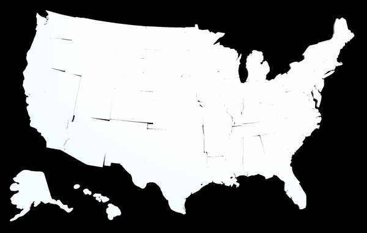

Using Unity I created this project as a TA for Dr. Aidong Lu's Immersive Vis Repository for her ITCS - 4123/5123 - Visualization and Visual Communication course at UNC Charlotte.

Link to the Immersive Vis Repository where other projects I worked on are: https://github.com/ImmersiveAnalyticsUNCC/Immersive.Unity.Vis

Last Modified: October 19th, 2020 by Christian Motley

Choropleth Running GIF:

Image of the choropleth map before data loads in:

Image of the choropleth map after data loads in:

